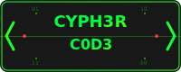

# 🚀 CYPH3R C0D3 - Quantum-Encrypted Web Code Editor

<div align="center">



**A cyberpunk-themed, secure web-based code editor with integrated terminal and file management**

[](https://nodejs.org/)
[](https://socket.io/)
[](https://microsoft.github.io/monaco-editor/)
[](#-security-features)
[](LICENSE)

</div>

## ✨ Features

### 🎯 Core Features
- **🔥 Monaco Editor** - Full VS Code engine with syntax highlighting for 100+ languages
- **🖥️ Integrated Terminal** - Real-time terminal with xterm.js and node-pty
- **📁 File Manager** - Complete CRUD operations with drag & drop support
- **🔄 Real-time Sync** - Socket.IO for instant updates
- **📱 Responsive Design** - Works on desktop, tablet, and mobile

### 🎨 Cyberpunk UI/UX
- **🌧️ Matrix Rain Background** - Animated falling code effect
- **⚡ Glitch Effects** - Authentic hacker aesthetic
- **🎵 Sound Effects** - Immersive cyberpunk audio feedback
- **🌈 Neon Color Scheme** - Eye-catching lime green terminals
- **🔮 Smooth Animations** - Fluid transitions and effects

### 🔒 Security Features
- **👤 User Authentication** - Bcrypt-hashed passwords with session management
- **🛡️ Rate Limiting** - Brute force protection (10 attempts/15min)
- **🚫 IP Banning** - Automatic temporary IP bans after failed attempts
- **🔐 IP Whitelisting** - Restrict access to specific IP addresses
- **⚠️ Security Headers** - Helmet.js for comprehensive HTTP security
- **🍪 Secure Sessions** - HTTPOnly cookies with 24-hour expiry

### 🚀 Performance Optimizations
- **⚡ WebSocket Compression** - Reduced bandwidth usage
- **📦 Data Batching** - Optimized terminal data transfer (2ms batches)
- **🧠 Buffer Management** - Efficient memory usage with 4KB chunks
- **🔄 Binary Transport** - Faster data transmission
- **🎯 RequestAnimationFrame** - Smooth UI updates

## 🎮 Demo


**Try it live:** [Demo Link](#) _(coming soon)_

## 🚀 Quick Start

### 1. Clone & Install
```bash
git clone https://github.com/rizkylangitramadani91/CYPH3R-C0D3-Editor.git
cd CYPH3R-C0D3-Editor
npm install
```

### 2. Security Setup
```bash
# Copy environment template
cp config.env.example .env

# Edit credentials (IMPORTANT!)
nano .env
```

**⚠️ Change default credentials:**
```env
ADMIN_USERNAME=your_username
ADMIN_PASSWORD=your_secure_password
SESSION_SECRET=generate-random-string-here
```

### 3. Run
```bash
npm start
```

### 4. Access
- Open: http://localhost:3000
- Login with your credentials
- Start coding! 🎉

## 🔒 Security Configuration

### Default Login (CHANGE IMMEDIATELY!)
```
Username: admin
Password: changeme123
```

### Environment Variables
| Variable | Description | Default |
|----------|-------------|---------|
| `AUTH_ENABLED` | Enable/disable authentication | `true` |
| `ADMIN_USERNAME` | Admin username | `admin` |
| `ADMIN_PASSWORD` | Admin password | `changeme123` |
| `SESSION_SECRET` | Session encryption key | (required) |
| `IP_WHITELIST` | Allowed IPs (comma-separated) | (empty = allow all) |
| `MAX_LOGIN_ATTEMPTS` | Max failed attempts before ban | `5` |
| `BAN_DURATION` | Ban duration in minutes | `15` |

### Production Security Checklist
- [ ] ✅ Changed default username/password
- [ ] 🔑 Generated secure session secret
- [ ] 🌐 Enabled HTTPS with SSL certificates
- [ ] 🛡️ Configured IP whitelist (if applicable)
- [ ] 🔍 Set up monitoring and logging
- [ ] 🚫 Ensured `.env` is not committed to git

## 🛠️ Installation & Deployment

### Local Development
```bash
# Install dependencies
npm install

# Start development server
npm start

# Access at http://localhost:3000
```

### Ubuntu/Linux Production Deployment

#### 1. Server Setup
```bash
# Update system
sudo apt update && sudo apt upgrade -y

# Install Node.js 18+
curl -fsSL https://deb.nodesource.com/setup_18.x | sudo -E bash -
sudo apt-get install -y nodejs

# Install PM2 for process management
sudo npm install -g pm2
```

#### 2. Deploy Application
```bash
# Clone repository
cd /var/www/
sudo git clone https://github.com/rizkylangitramadani91/CYPH3R-C0D3-Editor.git cypher-code
cd cypher-code

# Install dependencies
sudo npm install

# Setup environment
sudo cp config.env.example .env
sudo nano .env  # Configure your settings!

# Set permissions
sudo chown -R $USER:$USER /var/www/cypher-code
```

#### 3. Production Process Management
```bash
# Start with PM2
pm2 start server.js --name cypher-code

# Enable auto-restart on system reboot
pm2 startup
pm2 save

# Monitor logs
pm2 logs cypher-code
```

#### 4. Nginx Reverse Proxy + SSL
```nginx
# /etc/nginx/sites-available/cypher-code
server {
    listen 80;
    server_name your-domain.com;
    return 301 https://$host$request_uri;
}

server {
    listen 443 ssl http2;
    server_name your-domain.com;

    # SSL Configuration (use Let's Encrypt)
    ssl_certificate /etc/letsencrypt/live/your-domain.com/fullchain.pem;
    ssl_certificate_key /etc/letsencrypt/live/your-domain.com/privkey.pem;
    
    # Security headers
    add_header X-Frame-Options DENY;
    add_header X-Content-Type-Options nosniff;
    add_header X-XSS-Protection "1; mode=block";

    location / {
        proxy_pass http://localhost:3000;
        proxy_http_version 1.1;
        proxy_set_header Upgrade $http_upgrade;
        proxy_set_header Connection 'upgrade';
        proxy_set_header Host $host;
        proxy_set_header X-Real-IP $remote_addr;
        proxy_set_header X-Forwarded-For $proxy_add_x_forwarded_for;
        proxy_set_header X-Forwarded-Proto $scheme;
        proxy_cache_bypass $http_upgrade;
    }
}
```

#### 5. SSL with Let's Encrypt
```bash
# Install Certbot
sudo apt install certbot python3-certbot-nginx

# Get SSL certificate
sudo certbot --nginx -d your-domain.com

# Test auto-renewal
sudo certbot renew --dry-run
```

## 🎯 Advanced Features

### Multi-Terminal Support
- Create multiple terminal sessions
- Switch between terminals with tabs
- Each terminal maintains separate state
- Performance monitoring per terminal

### File Operations
- **📁 Create/Delete** files and folders
- **✏️ Rename** with inline editing
- **📤 Upload** multiple files via drag & drop
- **📥 Download** files and folders
- **🗜️ ZIP/Unzip** archive support
- **🔄 Move** files between directories

### Editor Features
- **🎨 Syntax Highlighting** for 100+ languages
- **🔍 Find & Replace** with regex support
- **📝 Multi-tab** editing
- **💾 Auto-save** and manual save
- **👀 Live Preview** for HTML files
- **📱 Split View** for side-by-side editing

### Keyboard Shortcuts
| Shortcut | Action |
|----------|---------|
| `Ctrl+N` | New File |
| `Ctrl+S` | Save File |
| `Ctrl+F` | Find in File |
| `Ctrl+`` | Toggle Terminal |
| `Ctrl+Shift+T` | New Terminal |
| `F5` | Refresh File Tree |
| `F1` | Show Help |

## 🔧 API Endpoints

### Authentication
- `POST /api/auth/login` - User login
- `POST /api/auth/logout` - User logout  
- `GET /api/auth/status` - Check auth status

### File Management
- `GET /api/files` - List files
- `GET /api/file/read` - Read file content
- `POST /api/file/write` - Write file content
- `POST /api/directory/create` - Create directory
- `DELETE /api/file` - Delete file/directory
- `PUT /api/file/rename` - Rename file/directory
- `PUT /api/file/move` - Move file/directory

### File Operations
- `POST /api/file/upload` - Upload files
- `GET /api/file/download` - Download files
- `POST /api/file/zip` - Create ZIP archive
- `POST /api/file/unzip` - Extract ZIP archive

### System
- `GET /api/health` - Health check
- `GET /api/socket-test` - Socket.IO test

## 🧪 Development

### Project Structure
```
CYPH3R-C0D3-Editor/
├── public/                 # Frontend assets
│   ├── app.js             # Main application logic
│   ├── styles.css         # Cyberpunk styling
│   ├── login.html         # Authentication page
│   ├── libs/              # Local libraries (xterm.js)
│   └── ...
├── workspace/             # User workspace (gitignored)
├── server.js              # Backend server
├── package.json           # Dependencies
├── .env                   # Environment config (gitignored)
├── config.env.example     # Environment template
├── SECURITY.md            # Security documentation
└── README.md              # This file
```

### Tech Stack
- **Backend:** Node.js, Express.js, Socket.IO
- **Frontend:** Vanilla JavaScript, Monaco Editor, xterm.js
- **Security:** bcrypt, express-session, helmet, express-rate-limit
- **File Processing:** archiver, unzipper, multer
- **Terminal:** node-pty for real terminal emulation

### Performance Benchmarks
- **Terminal Latency:** 2-10ms (optimized from 5-20ms)
- **File Operations:** < 100ms for files under 1MB
- **Memory Usage:** ~50MB base + ~10MB per terminal
- **Concurrent Users:** Tested up to 10 simultaneous users

## 🤝 Contributing

1. Fork the repository
2. Create feature branch (`git checkout -b feature/amazing-feature`)
3. Commit changes (`git commit -m 'Add amazing feature'`)
4. Push to branch (`git push origin feature/amazing-feature`)
5. Open Pull Request

## 📝 License

This project is licensed under the MIT License - see the [LICENSE](LICENSE) file for details.

## 🙏 Acknowledgments

- **Monaco Editor** - Microsoft's VS Code editor engine
- **xterm.js** - Terminal emulator for the web
- **Socket.IO** - Real-time bidirectional communication
- **Node-pty** - Pseudo terminal bindings for Node.js
- **Cyberpunk Aesthetics** - Inspired by classic hacker culture

## 📞 Support

- 📧 **Email:** [your-email@example.com]
- 🐛 **Issues:** [GitHub Issues](https://github.com/rizkylangitramadani91/CYPH3R-C0D3-Editor/issues)
- 💬 **Discussions:** [GitHub Discussions](https://github.com/rizkylangitramadani91/CYPH3R-C0D3-Editor/discussions)

---

<div align="center">

**⚡ Built with 💚 by the CYPH3R C0D3 Team ⚡**

*"Code in style, hack with purpose, secure with confidence"*

[](https://github.com/rizkylangitramadani91/CYPH3R-C0D3-Editor)

</div> 